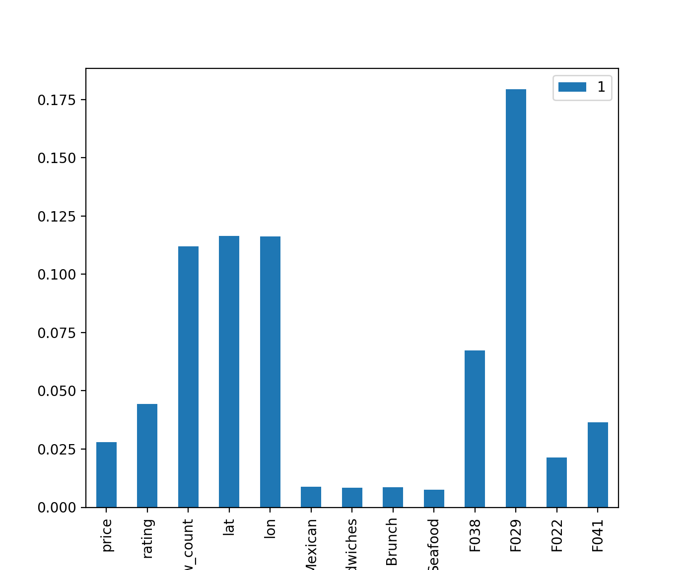

# LA_Violations_ML
Machine learning predictive analysis of restaurants in Los Angeles, California.

## About 
Can machine learning and data analysis identify "bad actors" in the restaurants near Hollywood? Data from the Yelp Developer API and the City of Los Angeles is normalized and analyzed with a special focus on rodent violations, but could be easily refocused other features.

## Data 
- Yelp API data includes rating, review counts, pricing and location information.
- Los Angeles, California public data accesses health code and demographic data to evaluate potential relationships between qualitative and quantitative measures. 
- Data can be easily adapted towards analysis of a variety of factors. We happened to focus on rodent violations here.

## File Structure
JSON and CSV files are in 'csv_files' directory. File paths may need to be adjusted according to environment.
Health code violation data came from this repository: <a href="https://github.com/mcarter-00/Rats-in-the-Restaurants"> Rats-in-the-Restaurants </a>
Folder named "python" contains all scripts.
Images folder holds visualizations including random forest tree.

## Frameworks
- Python
- Python Pandas
- Scikit-Learn

## Deployment
- Requires a Yelp developer API key
- API pull for Yelp is pull.ipynb

## Files
- The prequel and sequel to each file are named at the top of all Python files.
- Files app.py, merge.py clean.py and ml_prep.py normalize data. 
- The file basic.py is a backup of app.py and does not remove duplicate entries.
- Scikit-Learn script for random forest is in forest.py
- Prominent features explored in chart.py

## Findings
It seems that there is about a 90% success rate in identifying restaurants likely to have a vermin or insect violation. The results suggest that cuisine type does not have much bearing, although a few such as "Mexican" and "Seafood" may be a factor. There appears to be a range of latitude and longitude coordinates that carry predictive weight, so location may be suggestive of problem establishments. Health code violations related to toxicity also appear to be in play.

## 
Important Features

